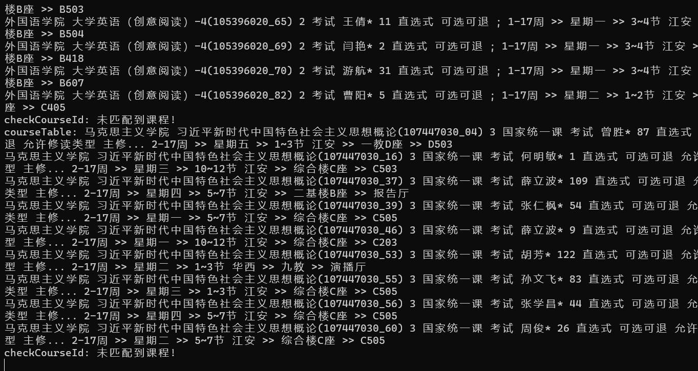
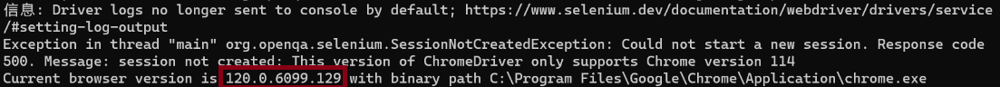

# RobClasses-Tool-for-SCU
一个简单的针对川大教务系统的抢课程序  
使用java8运行
```shell
java -jar RobClasses-Tool-for-SCU-1.3.jar
```

### 使用须知：   
1、使用前请确保你的 `C:\Program Files\Google\Chrome\chromedriver\` 路径下有Chrome Driver, 没有的话，请前往[ChromeDriver](https://googlechromelabs.github.io/chrome-for-testing/known-good-versions-with-downloads.json)下载相应版本; 同时，确保电脑上有Chrome浏览器;  
2、学号密码仅第一次需要输入，后续如果想修改在输入课程编号时输入0;  
3、课程编号`1234`或`1234_01`这两种格式都可以;  
4、课序号为下划线后面的数字，如`1234_01`的课序号为`01`, `0`不能省略;  
5、可以为一个课程匹配多个课序号,只需在同一行用空格隔开;  
6、可以在`config.properties`文件中修改查询时间间隔。




### 常见错误
1、ChromeDriver版本不匹配，请前往[ChromeDriver](https://googlechromelabs.github.io/chrome-for-testing/known-good-versions-with-downloads.json)下载相应版本（框选住的部分即为所需版本）

